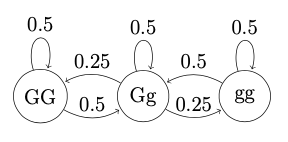
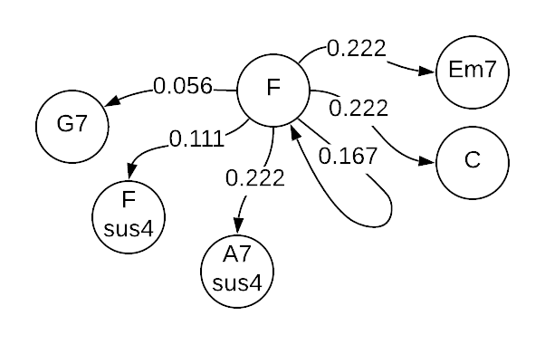
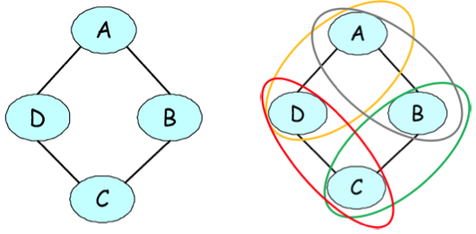
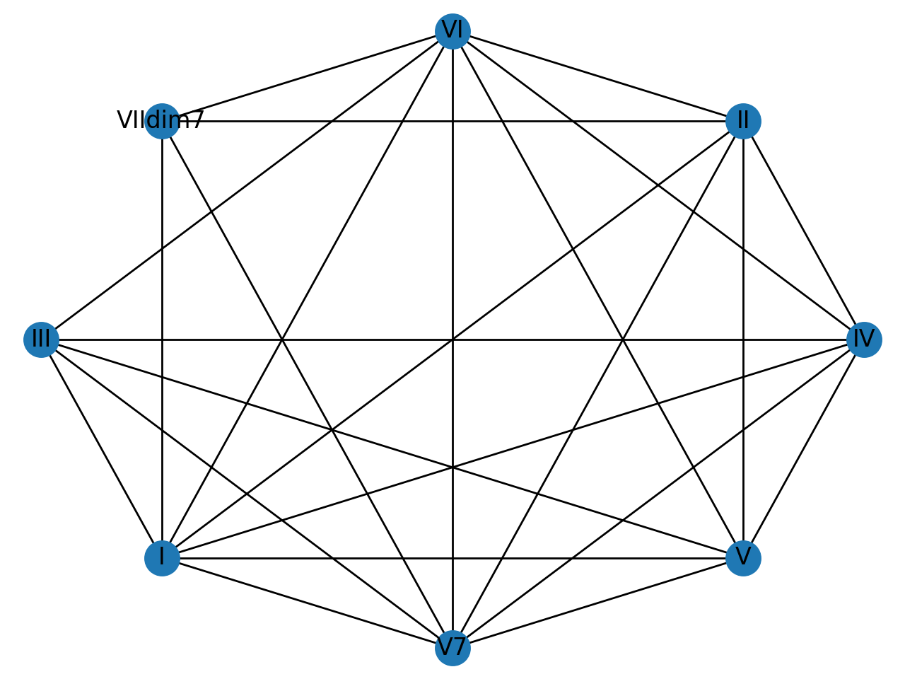

# Algorhythms

Generate music with a quantum computer!

## Installation

`brew install fluidsynth`

## Abstract

The creation of good music has been a coveted talent for centuries. Making a good song is quite difficult as one must know all the notes and which notes to play after the other in order to produce a 'banger'. As a society we have long relied on talented people to bring us the joy of music. We however, have challenged those individuals by successfully writing an algorithm that creates music while minimizing the dissonance between the notes. Using the D-wave Leap Sampler we applied the rules of music theory to a Markov Random Field in order to optimize the quality of the music and minimize the dissonance from one chord to another. Furthermore we translated the raw music we created into a playable file for all to experience quantum music using our custom CLI.

## Motivation and Goals

Our primary goal was to use quantum computing to create something amazing. We decided on music because we had not heard of anyone using quantum annealing to optimize the creation of music. Another reason we chose to explore music is because it is the universal language. Imbuing a program with the ability to write a universal language is in our opinion, amazing.

On a more technical note, we sought to successfully implement Random Walk on a quantum annealer, which has not been done yet. This opens the door for more computationally heaving stochastic processes to be implemented on quantum annealers.

## Background

### Some Music Theory

Music has a lot of distinct options for rules so we combined some classical compositional techniques with modern jazz theory to put contraints on our optimization function which allows for edge weighting on our markov chained states. Some interesting resources for further reading:
Mick Goodrick - The Advancing Guitarist
Ed Friedland - Building Walking Baselines
Vincent Persichetti - 20th-Century Harmony
Dave Liebman - A Chromatic Approach to Jazz Harmony and Melody

### Markov Chains

A Markov Chain is a graph that is used to represent state machines. It consists of nodes, representing states, and edges representing the transitions between those states. The edges can be weighted, and oftentimes represent the conditional probabilities of transitioning from one state to the next.

This is relevant to music generation, since we can encode the desired notes or chords as states, and using some basic music theory, define edges and transition probabilities between chords that should be played in succession. Here's an example Markov chain for some notes:

Now how can we generate music with this Markov Chain?

### Random Walks

It's simple! We can perform a 'random walk' on the matrix. We start with a given state, and using the transition probabilities, we can determine which state to go to next. This process has no memory - only the current state is ever taken into consideration. Random walks and other algorithms such as Markov Chain Monte Carlo (MCMC) are very powerful for stochastic simulations, and in our case, creating random music (that still abides by the laws of music theory)!

### Markov Random Fields

In order to implement a random walk or MCMC using D-Wave's samplers, however, we have to change our setup just a bit in order to formulate it as an optimization problem. This can be done using Markov Random Fields, which define relationships between and dependencies between vertices, instead of transition probabilities. Each edge `(a, b)` can be one of `00, 01, 10, 11`, indicating the binary values of its vertices. Each one of those states is associated with a potential energy, and our objective is now to find the lowest energy state of the entire Markov network.

Luckily, `dwave_networkx` allows us to do just that! We created the following Markov Random Field  for the chords `I, II, III, IV, V, VI, VIIdim`:

## How it works

Without spoiling the demo, our algorithm works by creating a random distribution of potentials for the chord Markov Random Field for each chord we want to generate, and then sampling that distribution for the lowest energy state. The chord with the lowest potential is our next chord! This is done for each chord. We then encode the chords into a MIDI file, which is returned by the user, and can be opened in software such as MuseScore in order to play it back, and even see the musical score!

## Setup
First, you need to [setup Ocean](https://docs.ocean.dwavesys.com/en/stable/overview/install.html) in order to use D-Wave. Make sure you activate the `virtualenv` before proceeding.

Then, install dependencies:
`$ pip install -r requirements.txt`

Optionally, you make the script executable:
`$ chmod +x algorythms.py`

Now the CLI!
`$ ./algorythms.py`

## Next Steps
We would like to add rhythm and melody to the generated chords, and explore more complex stochastic processes for generating music!

## References
[The mingus package](https://bspaans.github.io/python-mingus/)
[Markov Chains and Random Walks](https://ocw.mit.edu/courses/electrical-engineering-and-computer-science/6-262-discrete-stochastic-processes-spring-2011/video-lectures/lecture-20-markov-processes-and-random-walks/MIT6_262S11_lec20.pdf)
